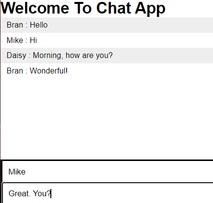

# Chat App

Front-end & back-end sections using `JavaScript` with 'Socket.IO' for real-time bi-directional connections

Data is stored and accessed using `MongoDB` `Atlas`.

## Client




## Server

```
og21893@DESKTOP-FEPUL9B:~/Chat_App$ npm start

> my-socketio@1.0.0 start
> node server.js

connected
a user connected
Lynne sends a msg: Hi, just came in. what's new?
user disconnected


```


## MongoDB
```Mongodb
>> db.msgs.find().limit(100);
<<  { _id: ObjectId("6367c2e8ce7f9b127a4188f0"),
      user: 'Bran',
      msg: 'Hello',
      __v: 0 }
    { _id: ObjectId("6367c32dce7f9b127a4188f1"),
      user: 'Mike',
      msg: 'Hi',
      __v: 0 }
    { _id: ObjectId("6367c3b7ce7f9b127a4188f2"),
      user: 'Daisy',
      msg: 'Morning, how are you?',
      __v: 0 }
```
